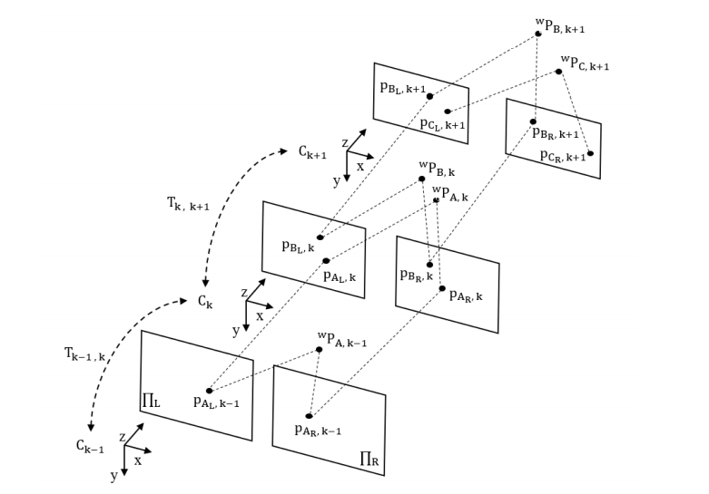

# **Real-time Stereo Visual Odometry with Local Non-Linear Least Square Optimisation**

## **About**

This project implements 6-DOF camera pose estimation from a calibrate stereo camera (with local non-linear least square optimisation) for various scenarios in KITTI dataset


## **Installation**

```bash
$ conda env create -f setup/environment.yml
$ pip install -e .
```

## **Usage**

For simulation of visual odometry, run the followig command

```bash
$ python main.py --config_path configs/params.yaml
```

The `params.yaml` needs to be edited to configure the sequence to run the simulation.

## **About the Problem !**

**1. What is Visual Odometry ?** <br>
**2. Problem Formulation**  <br>
**3. Algorith Implemented** <br>

### **Visual Odometry**

Visual Odometry is the process of incrementally estimating the pose and trajectory of a robot or a vehicle (orientation and translation of a camera configuration rigidly attached to it) using video stream from the camera.

### **Problem Formulation**

An agent is moving through an environment and taking
images with a rigidly attached camera system at discrete
time instants. Let the stream of images coming from the pair of camera
(assumed stereo configuration) be denoted by I<sub>L, k</sub> and I<sub>R, k</sub> at time instant *k* . We assume that we have prior knowledge of all the intrinsic as well as extrinsic calibration parameters of the stereo rig. 

We need to estimate the relative rotation *R* and translation *t* between stereo configuration at time instants *k-1* and *k* and then to concatenate the transformation to incrementally recover the full trajectory C<sub>k</sub> of the camera

### **Algorithm Implemented**
3D-to-2D: Structure to feature correspondences (Source : [1]) <br>
- &nbsp;Compute the first stereo image frames I<sub>L,K</sub> and I<sub>R,K</sub> <br>
- &nbsp;Extract and match stereo features f<sub>L,K</sub> and f<sub>R,K</sub> <br>
- &nbsp;Triangulate features to build point cloud X<sub>k</sub> <br>
- &nbsp;Set initial camera pose C<sub>k</sub> <br>
- &nbsp;Store information from the first frame as I<sub>L,k-1</sub>, I<sub>R,k-1</sub>, f<sub>L,k-1</sub>, f<sub>R,k-1</sub>, X<sub>k-1</sub> <br>
&nbsp;While exists a new image frame: <br>
    - Compute the new stereo image pair I<sub>L,K</sub> and <sub>R,K</sub> <br>
    - Extract and match stereo features f<sub>L,K</sub> and f<sub>R,K</sub> <br>
    - Triangulate features to build point cloud X<sub>k</sub> <br>
    - Track 2D features f<sub>L,k-1</sub> at I<sub>L,k-1</sub> to f<sub>L,k</sub> at I<sub>L,K</sub> and thus obtain <sup>t</sup>f<sub>k-1,k</sub> <br>
    - Compute correspondence for the tracked features <sup>t</sup>f<sub>k-1,k</sub> <br> and X<sub>k-1</sub> <br>
    - Compute camera pose estimation (P3P), thus T = [R|t]
    - Concatenate transformation by C<sub>k</sub> = C<sub>k-1</sub> T<sub>k</sub>
    - If Optimisation is enabled, do non-linear least squares optimisation of T 
    - Store informaton from first frame as I<sub>L,k-1</sub>, I<sub>R,k-1</sub>, f<sub>L,k-1</sub>, f<sub>R,k-1</sub>, X<sub>k-1</sub> and C<sub>k-1</sub> <br>
<br>
<p align="center"> 
  <br>
<p align="center" style="font-size:30%;"> <em> Relative Camera Pose and Concatenation of Transformations (Source: E. F. Aguilar Calzadillas [1] </em>) </p>
</p>

## Future Work
- [ ] Implement Windowed Bundle Adjustment
- [ ] Implement Graph Based Optimisation in Visual SLAM
- [ ] Visualise 3D point cloud of scene using Point Cloud Library (PCL)

## **References**

[1]  ****E. F. Aguilar Calzadillas****, **"Sparse Stereo Visual Odometry with Local Non-Linear Least-Squares Optimization for Navigation of Autonomous Vehicles"**,  M. A. Sc. Thesis, Department of Mechanical and Aerospace Engineering, Carleton University, Ottawa ON, Canada, 2019
<br />

[2]  **D. Scaramuzza, F. Fraundorfer**, *"Visual Odometry: Part I - The First 30 Years and Fundamentals"*,  IEEE Robotics and Automation Magazine, Volume 18, issue 4, 2011
<br />

[3]  **F. Fraundorfer, D. Scaramuzza**, *"Visual odometry: Part II - Matching, robustness, optimization, and applications"*, IEEE Robotics and Automation Magazine, Volume 19, issue 2, 2012

[4] **Avi Singh**, *Visual Odmetry from scratch - A tutorial for beginners*, Avi Singh's Blog

## Contact
Saksham Jindal (saksham.jindal@outlook.com)